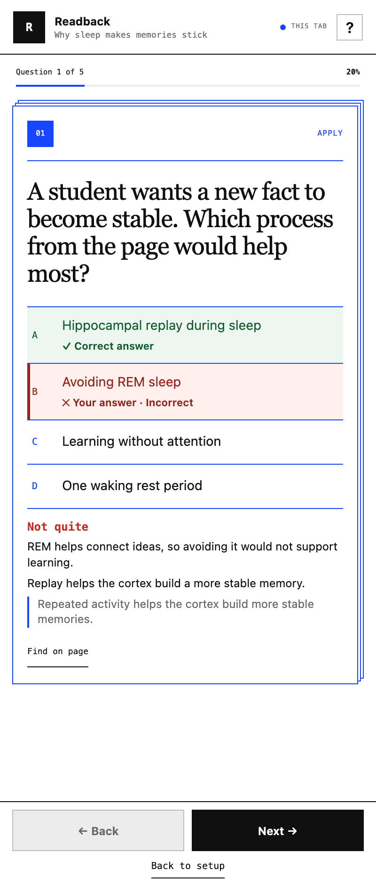
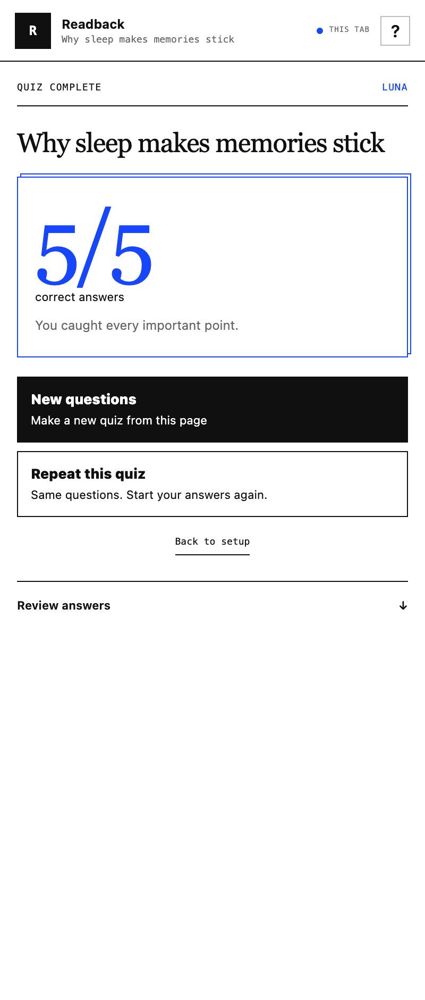
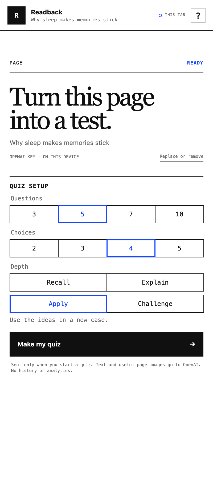

<div align="center">
  
  <h1>Readback</h1>
  <p><strong>Turn the page you’re reading into a quiz.</strong></p>
  <p>A small side-panel extension for Chrome and Vivaldi.<br>One question at a time. Immediate feedback. Your own OpenAI key.</p>
  <p><a href="#get-started">Get started</a> · <a href="#keyboard-controls">Keyboard controls</a> · <a href="#your-data">Your data</a> · <a href="#development">Development</a></p>
</div>

<table>
  <tr>
    <th width="33%">Test your understanding</th>
    <th width="33%">Learn from each answer</th>
    <th width="33%">Try again or go further</th>
  </tr>
  <tr>
    <td></td>
    <td></td>
    <td></td>
  </tr>
</table>

<sub>Actual extension UI with a fixed demo quiz. No API key or live request is used for these screenshots.</sub>

## What you can do

- **Quiz the current page.** Use readable text, charts, diagrams, and useful images as source material.
- **Choose the size and depth.** Make 3, 5, 7, or 10 questions, with 2–5 choices each.
- **Learn as you answer.** Get immediate feedback and supporting evidence. Use **Find on page** to highlight matching source text.
- **Keep your place.** Each tab has its own quiz and progress for the browser session.
- **Repeat or refresh.** Repeat the same questions without an API call, or request new questions from the same page.
- **Use a narrow panel.** Controls adapt to the available space, with scrolling for longer questions.

| Depth | What it asks you to do |
| --- | --- |
| Recall | Remember a fact from the page. |
| Explain | Explain an idea or relationship. |
| Apply | Use an idea in a new case. |
| Challenge | Combine source ideas in a new scenario or comparison. |

Quizzes are in English, including when the source page is in another language.

<details>
<summary><strong>See the quiz setup</strong></summary>
<br>

</details>

## Get started

**Version 0.2.3 · Install as an unpacked extension · No build step**

You need Chrome or Vivaldi and your own OpenAI API key. API usage is charged to your OpenAI account. Readback has no separate account or companion app.

1. Download the repository with **Code → Download ZIP**, then extract it. Or clone it:

   ```bash
   git clone https://github.com/Wolbyworld/readback.git
   ```

2. Open `chrome://extensions` or `vivaldi://extensions`.
3. Enable **Developer mode**, then select **Load unpacked**.
4. Select the **`extension/` folder** inside the downloaded repository.
5. Open a webpage and select Readback from the browser toolbar. Pin it for easy access.
6. Add your OpenAI key. Choose **On this device** or **This session only**.
7. Set the quiz size and depth, then select **Make my quiz**.

Node.js, a terminal, and the local evaluation service are **not required to use the extension**. Readback is not yet listed in the Chrome Web Store.

**Vivaldi permanent panel:** the first quiz may ask for website access. Select **Allow website access** and approve the browser prompt. Page data is sent only when you start a quiz.

**Update:** get the latest repository files, keep the `extension/` folder at the same location, and click **Reload** on the browser’s extensions page. Reopen the panel if it was already open.

## Keyboard controls

Shortcuts work while the **Readback panel has focus**. Select the **?** button in the header to see them at any time.

| Key | Action |
| --- | --- |
| **A–E** or **1–5** | Choose an available answer. |
| **←** / **→** | Previous question / next answered question. |
| **Tab** / **Shift+Tab** | Move between controls. |
| **Enter** / **Space** | Activate the focused button. |
| **Arrow keys** in setup | Change the focused setting. |
| **Esc** | Close shortcut help, cancel loading, or return to setup. |
| **?** | Show shortcut help. |

Focus moves to each new question and to **Next** after an answer. Returning to setup keeps the current quiz available. To start a quiz, activate its button.

## Your data

- **Your key, your browser.** Keep the key on the device or for the browser session only. Replace or remove it from setup. Readback does not sync it or show it again after saving.
- **An explicit action starts each request.** Page text and up to three useful visuals go directly from the extension to OpenAI. A visible-page capture can be used when useful visuals cannot be extracted.
- **Local progress.** Quizzes, answers, and source information use browser session storage. Settings and saved keys use local storage; quiz images are cached locally in IndexedDB. Readback has no analytics or cloud history service.
- **Direct API requests.** The extension uses the OpenAI Responses API with `store: false`. There is no Readback server between your browser and OpenAI.

## A few limits

- Browser settings pages, extension stores, and some protected pages cannot be read.
- **Find on page** needs matching source wording. A summary or translation may not match.
- Generated questions and explanations can be wrong. Use the source evidence to check them.
- **New questions** checks for repeated wording; similar ideas can still appear.
- Quiz progress is tied to the browser session, not a permanent learning history.

## Development

Plain JavaScript, Manifest V3, and browser APIs. The extension has no runtime npm dependencies and no build step.

| Path | Purpose |
| --- | --- |
| [`extension/`](extension/) | The unpacked browser extension. |
| [`tests/`](tests/) | Automated tests, browser fixtures, and evaluation tools. |
| [`server/`](server/) | Optional local service for model evaluation. |
| [`docs/HANDOFF.md`](docs/HANDOFF.md) | Architecture, validation evidence, and release notes. |
| [`previews/`](previews/) | Screenshots used in this README. |

Use Node.js 20 or newer for development checks:

```bash
npm test
node --check extension/service-worker.js
node --check extension/sidepanel.js
```

To inspect the UI with demo content and no API calls:

```bash
node tests/ui-harness-server.mjs
```

Open `http://127.0.0.1:41740`. Add `?state=quiz`, `?state=feedback`, or `?state=results` to inspect a screen.

With that server running, use `node tests/capture-previews.mjs` in another terminal to refresh the README screenshots. This needs Node.js 22 or newer and Chrome/Chromium; it uses a temporary browser profile and the fixed demo quiz.

<details>
<summary><strong>Optional model evaluation</strong></summary>

Normal extension use does not need this service. For model evaluation, put a development key in `.env.local` at the repository root, then run:

```bash
npm start
# In another terminal:
READBACK_EVAL_RUNS=3 node tests/model-quality-eval.mjs
```

Evaluation output stays under ignored `artifacts/evals/`. Do not commit keys, browser profiles, page captures, or evaluation output. See the [development handoff](docs/HANDOFF.md) before changing the model, prompt, schema, or graders.

</details>
