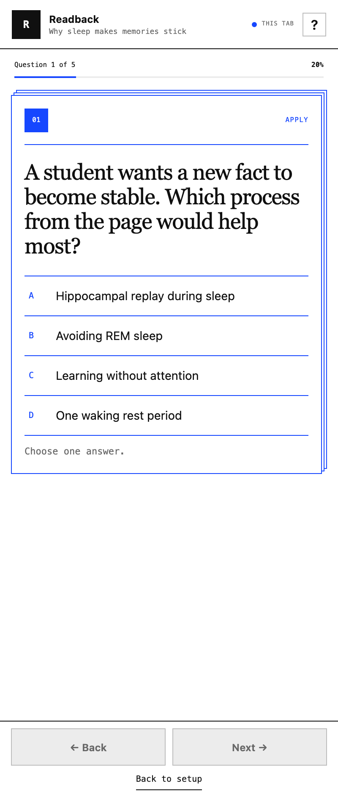

# Readback

Readback turns the page in your active browser tab into a short learning quiz. It uses the approved **Stack** interaction: one question at a time, with each answered card moving up.



Status: local test candidate `0.2.2`. Native browser verification for this candidate is pending. The previous `0.2.0` release was tested unpacked in Chrome and Vivaldi. It is not published in the Chrome Web Store.

## What it does

- Makes 3, 5, 7, or 10 multiple-choice questions.
- Uses 2 to 5 answer options.
- Supports Recall, Explain, Apply, and Challenge levels.
- Uses page text, useful diagrams, charts, and meaningful images.
- Always writes the quiz in English.
- Uses `gpt-5.6-luna` with adaptive reasoning: low for Recall and Apply, medium for Explain, and high for Challenge.
- Gives feedback for every answer option.
- Keeps each tab's quiz and answers separate for the current browser session.

Challenge questions combine at least two source ideas in a new scenario, comparison, or counterfactual. They do not need outside knowledge.

## Install it

### From a fresh computer

Requirements: Git, Chrome or Vivaldi, and Node.js 20 or newer for tests and model evaluation.

```bash
git clone git@github.com:Wolbyworld/readback.git
cd readback
npm test
```

The extension has no package install or build step. Load the checked-in `extension` directory directly in the browser.

### Load the extension

In Vivaldi:

1. Open `vivaldi://extensions`.
2. Turn on **Developer mode**.
3. Click **Load unpacked**.
4. Select the `extension` folder in this Readback folder.
5. Pin Readback. Click its toolbar button on a normal webpage.

Chrome uses the same steps at `chrome://extensions`.

Vivaldi can also keep Readback in a permanent panel. The first time, select **Allow website access** and approve the browser prompt. Readback reads and sends page data only after you start a quiz.

## Add your OpenAI key

Readback asks for an OpenAI API key the first time that it opens. Choose one storage mode:

- **On this device** keeps the key after a browser restart.
- **This session only** removes the key when the browser closes.

You can replace or remove the key from the quiz setup screen. Readback clears the key field after save. It never shows the saved key, syncs it, logs it, or puts it in an error message.

Normal use needs only the extension. It does not need a Terminal window, local service, or companion app.

## Private by design

Readback sends data only after you click **Make my quiz**. It sends the readable page text and up to three useful page visuals directly to the OpenAI Responses API. If no useful visual can be extracted, it can send the visible page capture instead.

The extension service worker owns the key and the OpenAI request. Extension storage is limited to trusted extension contexts. The request uses `store: false`. Readback does not keep quiz history, page content, or analytics.

Browser system pages, extension stores, and some protected pages cannot be read. On those pages, open a normal website and try again.

## Optional development service

The local service remains available only for live model evaluation and development. It is not part of the product runtime.

1. Put a development key in `.env.local` at the project root. Do not put it in the extension folder.
2. Run `npm start`, or double-click `start-readback.command`.
3. Run `READBACK_EVAL_RUNS=3 node tests/model-quality-eval.mjs` in another Terminal window.

If only a deterministic grader changes, regrade a complete saved matrix with `npm run eval:regrade -- artifacts/evals/<artifact>.json`. Regrading fails if any quiz generation is missing.

## Local checks

- `npm test`
- `node --check extension/service-worker.js`
- `node --check extension/sidepanel.js`

## Continue development

- [Development handoff](docs/HANDOFF.md) explains the architecture, data flow, test strategy, current limits, and release checklist.
- [Agent instructions](AGENTS.md) give coding agents the exact project rules and commands.
- `CLAUDE.md` points Claude-based tools to the same project instructions.

## Verified in automated tests

- Persistent, session-only, replacement, and removal key flows.
- Direct Luna Responses API request with adaptive reasoning, `store: false`, strict schema, and all visual references.
- Safe missing-key, invalid-key, rate-limit, network, and timeout errors.
- English output, hostile page instructions, Challenge rules, and visual-question rules.
- Settings, Back/Next motion, answer feedback, scoring, retry, replacement, and resume wiring.
- The final Luna matrix passed 18/18 quiz sets and 54/54 generated questions across six representative source risks.

## Verified in browsers

Readback 0.2.0 was tested on September 4, 2026 in Chrome for Testing 152 and Vivaldi 7.7.

- The toolbar button opens the native Chrome side panel.
- The Lenny's Newsletter design article creates a valid quiz in Vivaldi and Chrome.
- A long Vivaldi Challenge request stays active until the quiz is ready.
- An ocean-currents fixture creates a question that shows and uses a page diagram.
- Lenny and ocean-currents quizzes keep separate question, answer, and progress state when tabs change.
- Wrong answers show the failed choice, the correct explanation, and source evidence.
- Back to setup, resume, and replacement quiz actions work.
